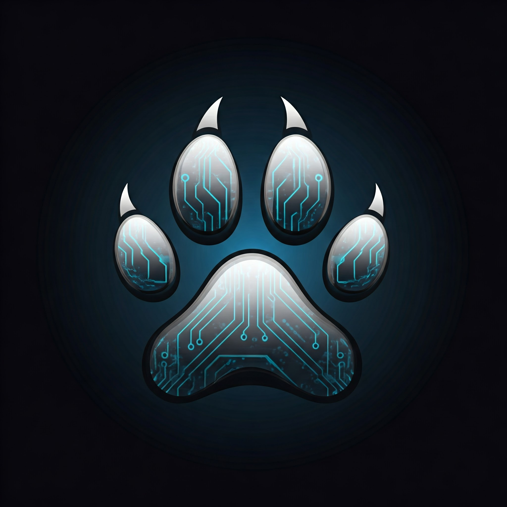

<div align="center">
  

  # 🎮 Bark Engine
  
  
  
  
  *A lightweight, code-first JavaScript game engine for rapid 2D game development*

  [**🌐 Try the Demo**](https://krunk-theduck.github.io/BarkGameEngineDemo/) 

  [Features](#features) •
  [Quick Start](#quick-start) •
  [Documentation](#documentation)

</div>

---

## 📑 Table of Contents
- [🎯 Philosophy](#-philosophy)
- [💡 Why Bark Engine?](#-why-bark-engine)
- [🛠️ Core Architecture](#️-core-architecture)
  - [🎯 Engine](#engine)
  - [🎬 Scene](#scene)
  - [📷 Camera](#camera)
  - [🎮 Entities](#entities)
  - [🐛 Debug](#debug)
  - [📜 Scripts](#-scripts)
- [Basic HTML Setup](#-basic-html-setup)
- [🎮 Quick Start](#-quick-start)
- [🚀 Upcoming Features](#-upcoming-features)
  - [🎨 Image & Texture System](#-image--texture-system)
  - [🎬 Animation System](#-animation-system)
  - [🎵 Audio System](#-audio-system)

## 🎯 Philosophy

Bark Engine embraces a fundamental truth: game development doesn't need complex IDEs or visual editors to be powerful. Built with pure vanilla JavaScript, Bark Engine brings game development back to its roots - the code.

We believe that the best tools are those that enhance your existing workflow rather than replace it. That's why Bark Engine integrates seamlessly with your favorite code editor, whether it's VS Code, Sublime Text, or any other.

## 💡 Why Bark Engine?

- **Code-First Approach**: Direct access to engine features through clean, intuitive APIs
- **Editor Agnostic**: Use your preferred code editor and development environment
- **Zero Dependencies**: Built with pure vanilla JavaScript - no frameworks, no bloat
- **Lightweight & Fast**: Minimal overhead means better performance for your games
- **Developer Friendly**: Designed for developers who love to code

<div align="center">
  <sub>Built with ❤️ by the Bark Engine Team</sub>
</div>

## 🛠️ Core Architecture

Bark Engine is built around five fundamental components, each designed to handle specific aspects of game development. These components work together seamlessly while maintaining clean separation of concerns.


### Core Components

<div align="center">

| Component | Description |
|-----------|-------------|
| [🎯 Engine](#engine) | The heart of Bark Engine - manages the game loop, state, and coordinates all other components |
| [🎬 Scene](#scene) | Handles scene management, object hierarchies, and scene transitions |
| [📷 Camera](#camera) | Controls viewport, rendering, and manages multiple camera perspectives |
| [🎮 Entities](#entities) | Provides the entity component system for game objects and behaviors |
| [🐛 Debug](#debug) | Offers development tools, logging, and performance monitoring |
| [📜 Scripts](#scripts) | Provides a flexible, Unity-like component architecture for game behaviors |


</div>

Each component is designed to be modular yet interconnected, allowing you to use as much or as little of the engine's capabilities as your project requires.

---

## Engine
[🔝 Back to Top](#-bark-engine)

The Engine class serves as the central nervous system of Bark Engine, orchestrating all core functionalities and maintaining the game state. It's designed as a singleton to ensure consistent state management across your entire game.

### Key Responsibilities

- **Game Loop Management**: Controls the main update and render cycle, maintaining consistent FPS
- **Scene Orchestration**: Manages active scenes and handles scene transitions
- **Script Management**: Stores and handles user-generated scripts for dynamic behavior
- **Resource Control**: Maintains references to all game resources and entities
- **Performance Monitoring**: Tracks delta time and manages frame timing

### Basic Usage
```javascript
// Initialize the engine
const engine = new Engine();
// Load a custom script
await engine.loadScript('PlayerController');
// Start the game loop
engine.start();
// Toggle pause state
engine.togglePause();
```

### Key Features

- **Automatic Delta Time**: Ensures smooth gameplay regardless of frame rate
- **Dynamic Script Loading**: Load and unload scripts at runtime
- **Debug Integration**: Built-in performance monitoring and debugging tools
- **Scene Management**: Seamless scene transitions and state management
- **Entity Tracking**: Centralized entity management system

## Scene
[🔝 Back to Top](#-bark-engine)

The Scene class serves as the environment manager for your game, handling everything from map loading and collision detection to entity management and parallax backgrounds. It provides a robust foundation for creating rich, interactive game worlds.

### Key Responsibilities

- **Map Management**: Loads and manages game maps with collision data
- **Entity Control**: Maintains and updates all scene entities
- **Collision System**: Provides efficient collision detection using Uint8Array
- **Background Handling**: Supports static and parallax backgrounds
- **Scene State**: Manages scene lifecycle and persistence

### Basic Usage
```javascript
// Create and initialize a scene
const scene = new Scene();

// Load a map with collisions
await scene.loadMap('level1.png', 'level1_collision.png');

// Add a parallax background
scene.addParallaxLayer('mountains.png', 0.5);

// Add entities to the scene
scene.addEntity(player);
scene.addEntity(enemy);

// Store scene-specific data
scene.setSceneData('checkPoint', {x: 100, y: 200});
```

### Key Features

- **Optimized Collision Detection**: Fast collision checking using Uint8Array for performance
- **Flexible Entity Management**: Add, remove, and query entities with tag support
- **Parallax Support**: Multiple background layers with independent scroll speeds
- **Data Persistence**: Scene-specific data storage for game state management
- **Debug Visualization**: Built-in collision map visualization for debugging
- **Lifecycle Hooks**: onEnter/onExit hooks for scene transitions

## Camera
[🔝 Back to Top](#-bark-engine)

The Camera class manages viewport rendering and world-to-screen coordinate transformations. It provides a flexible system for handling multiple viewports, camera following behavior, and scene rendering with smooth transitions.

### Key Responsibilities

- **Viewport Management**: Creates and manages individual canvas viewports
- **Coordinate Transformation**: Handles world-to-screen and screen-to-world conversions
- **Target Following**: Smooth entity tracking with customizable offset and boundaries
- **Scene Rendering**: Manages the rendering pipeline including backgrounds, entities, and debug information
- **Transform Control**: Handles camera scaling, rotation, and positioning

### Basic Usage
```javascript
// Create a camera with specific dimensions
const camera = new Camera(800, 600);

// Set camera boundaries
camera.setBounds(0, 0, 2000, 1500);

// Enable smooth camera following
camera.setSmoothing(true, 0.1);

// Make camera follow a player entity
camera.follow(player, { x: 0, y: -50 });

// Convert coordinates between world and screen space
const screenPos = camera.worldToScreen(worldX, worldY);
const worldPos = camera.screenToWorld(screenX, screenY);
```

### Key Features

- **Multiple Viewports**: Support for multiple independent camera views
- **Smooth Following**: Configurable smooth movement when following targets
- **Boundary Control**: Customizable camera boundaries to limit movement
- **Debug Integration**: Built-in debug visualization support
- **Flexible Rendering**: Handles layered rendering with proper ordering
- **Transform Stack**: Managed transform state for accurate coordinate mapping

## Entities
[🔝 Back to Top](#-bark-engine)

The Entities system provides the foundation for all game objects in Bark Engine. It includes a base Entity class with comprehensive features for positioning, rendering, collision detection, and script management, along with specialized classes like Player for specific game elements.

### Key Responsibilities

- **Transform Management**: Handles position, rotation, scale, and velocity
- **Script System**: Supports dynamic script attachment and lifecycle management
- **Collision Handling**: Provides flexible collision detection and bounds management
- **State Control**: Manages entity state, tags, and custom data storage
- **Rendering Pipeline**: Controls entity visualization with debug support

### Basic Usage
```javascript
// Create a basic entity
const entity = new Entity(100, 100);

// Set up collision bounds
entity.setCollisionBounds(32, 32, -16, -16);

// Attach a behavior script
await entity.attachScript('EnemyBehavior');

// Add tags for identification
entity.addTag('enemy');
entity.addTag('hostile');

// Store custom data
entity.setData('health', 100);
entity.setData('damage', 25);

// Create a player instance
const player = new Player(150, 150);
```

### Key Features

- **Component-Based Design**: Flexible entity composition through script attachment
- **Collision System**: Built-in collision detection with customizable bounds
- **Tag System**: Efficient entity categorization and filtering
- **Custom Data Storage**: Flexible key-value storage for entity-specific data
- **Debug Visualization**: Built-in debug rendering for collision bounds
- **Player Singleton**: Specialized Player class with input handling and movement

## Debug
[🔝 Back to Top](#-bark-engine)

The Debug system provides comprehensive development tools for monitoring, inspecting, and modifying game state in real-time. It features an interactive debug console with performance metrics, object inspection, and state manipulation capabilities.

### Key Responsibilities

- **Performance Monitoring**: Tracks FPS, frame timing, and engine metrics
- **State Inspection**: Real-time viewing and modification of game objects
- **Console Interface**: Interactive debug console with search and filtering
- **Visual Debugging**: Collision bounds and entity visualization
- **Object Tracking**: Dynamic tracking of engine components and entities

### Basic Usage
```javascript
// Configure debug settings
engine.debug.configure({
    showFPS: true,
    showDelta: true,
    showEntityCount: true
});

// Enable debug mode
engine.debug.setEnabled(true);

// Track custom objects
engine.debug.trackObject('player', playerInstance);

// Toggle debug console (default: F8)
// Access real-time state inspection and modification
```

### Key Features

- **Interactive Console**: Real-time game state inspection and modification
- **Performance Metrics**: Built-in FPS and timing measurements
- **Object Tracking**: Dynamic object inspection with path navigation
- **Search Functionality**: Quick access to specific debug information
- **Visual Indicators**: Debug overlays for game objects and collisions
- **State Persistence**: Maintains debug settings between sessions

## 📜 Scripts
[🔝 Back to Top](#-bark-engine)

The Scripts system in Bark Engine provides a flexible, Unity-like component architecture where custom behaviors can be attached to entities. All user scripts are stored in the `scripts/` directory and can be dynamically attached to and detached from entities during runtime.

### Script Structure

Every script follows a consistent lifecycle pattern with optional methods:

```javascript
// scripts/ExampleScript.js
export default class ExampleScript {
    constructor(entity) {
        this.entity = entity;
    }

    async init() {
        // Called when script is first attached
        // Perfect for setup, resource loading, and initialization
    }

    update(deltaTime) {
        // Called every frame
        // Handle game logic, input, movement, etc.
    }

    render(ctx) {
        // Custom rendering logic
        // Override entity's default rendering
    }

    async onDetach() {
        // Cleanup when script is removed
        // Remove event listeners, clear resources, etc.
    }
}
```

### Example: Player Controller

Here's a practical example of a script that handles player movement and rotation:

```javascript
// scripts/PlayerController.js
export default class PlayerController {
    constructor(entity) {
        this.entity = entity;
        this.rotation = 0;
        this.mouseX = 0;
        this.mouseY = 0;
        this.setupMouseTracking();
    }

    update(deltaTime) {
        // Handle player rotation based on mouse position
        const screenX = window.mainCamera.canvas.offsetParent.offsetLeft + this.entity.relativeX;
        const screenY = window.mainCamera.canvas.offsetParent.offsetTop + this.entity.relativeY;
        
        const dx = this.mouseX - screenX;
        const dy = this.mouseY - screenY;
        this.rotation = Math.atan2(dy, dx);
    }

    render(ctx) {
        // Custom player rendering with rotation
        ctx.save();
        ctx.translate(this.entity.x, this.entity.y);
        ctx.rotate(this.rotation);
        
        // Draw player triangle
        ctx.beginPath();
        ctx.moveTo(55, 0);
        ctx.lineTo(30, -10);
        ctx.lineTo(30, 10);
        ctx.closePath();
        ctx.fillStyle = '#0088ff';
        ctx.fill();
        
        ctx.restore();
    }
}
```

### Using Scripts

Scripts can be attached to entities in several ways:

```javascript
// In main.js or other scripts
const player = new Player(100, 100);
await player.attachScript('PlayerController');

// Or dynamically during gameplay
const enemy = new Entity(200, 200);
await enemy.attachScript('EnemyBehavior');

// Remove scripts when needed
await entity.detachScript('PlayerController');
```

### Key Features

- **Entity Reference**: Every script has access to its attached entity
- **Lifecycle Methods**: Clear lifecycle with init, update, render, and cleanup hooks
- **Async Support**: Handles asynchronous operations for resource loading
- **Dynamic Attachment**: Scripts can be attached and detached at runtime
- **Method Override**: Can override entity methods like render for custom behavior
- **Resource Management**: Built-in cleanup through onDetach method

## Basic HTML Setup
[🔝 Back to Top](#-bark-engine)

Setting up Bark Engine is straightforward. All you need is a basic HTML file that links the engine's core scripts and your main entry point.

### Basic Setup

```html
<!DOCTYPE html>
<html lang="en">
<head>
    <meta charset="UTF-8">
    <meta name="viewport" content="width=device-width, initial-scale=1.0">
    <title>Bark Engine Game</title>
</head>
<body>
    <div id="game-container">
        <!-- Canvases will be automatically created here -->
    </div>

    <!-- Engine Core -->
    <script src="engine/debug.js"></script>
    <script src="engine/engine.js"></script>
    <script src="engine/scene.js"></script>
    <script src="engine/entities.js"></script>
    <script src="engine/camera.js"></script>

    <!-- Your Game Code -->
    <script src="main.js"></script>
</body>
</html>
```

### Key Points

- **Minimal Setup**: Only requires linking engine scripts and your main.js
- **Automatic Canvas**: The engine handles canvas creation and management
- **Script Order**: Engine scripts must be loaded in the correct order
- **Game Container**: Provides a container for the game canvas
- **Responsive Design**: Basic CSS ensures proper canvas scaling and positioning

Once your HTML is set up, you can start building your game in `main.js`. The engine scripts provide all the necessary classes and functionality to create your game world.

## 🎮 Quick Start
[🔝 Back to Top](#-bark-engine)

Your `main.js` file is where your game comes to life. Here's a complete example of setting up a simple game with a player, enemy, and map:

```javascript
// Initialize core systems
const engine = new Engine();
const mainCamera = new Camera(800, 600);
window.mainCamera = mainCamera;
window.engine = engine;

// Configure debug tools
engine.setDebug(true, {
    showFPS: true,
    showDelta: true,
    showEntityCount: true
});

// Create main game scene
const gameScene = new Scene();
var player;
var enemy;

async function initializeGame() {
    console.log('Initializing game...');
    
    // Create and add player
    player = new Player(400, 300);
    gameScene.addEntity(player);

    // Create and add enemy
    enemy = new Entity(700, 400);
    gameScene.addEntity(enemy);

    // Set up camera
    mainCamera.follow(player);
    mainCamera.setSmoothing(true, 0.1);

    // Set up scene
    engine.addScene('main', gameScene);
    engine.loadScene('main');

    // Load map (with error handling)
    try {
        await gameScene.loadMap(
            'assets/maps/map.png',
            'assets/maps/map_col.png'
        );
        mainCamera.setBounds(0, 0, 1920, 1080);
    } catch (error) {
        console.warn('Map not loaded:', error);
        mainCamera.setBounds(0, 0, 800, 600);
    }

    // Initialize and start
    engine.initializeSystems();
    start();
}

// Attach behavior scripts
async function start() {
    await player.attachScript('PlayerController');
    await enemy.attachScript('EnemyBehavior');
}

// Start when page loads
window.addEventListener('load', initializeGame);
```

### Key Steps

1. **Initialize Core Systems**
   - Create engine instance
   - Set up main camera
   - Configure debug settings

2. **Create Game Scene**
   - Set up main scene
   - Add entities (player, enemies, etc.)
   - Configure camera following

3. **Load Resources**
   - Load map images
   - Set camera boundaries
   - Handle loading errors

4. **Attach Scripts**
   - Wait for initialization
   - Attach behavior scripts to entities
   - Start game logic

### Project Structure
```
your-game/
├── engine/          # Bark Engine core files
├── scripts/         # Your game scripts
├── assets/          # Game assets
│   ├── maps/
│   ├── sprites/
│   └── sounds/
├── index.html       # Game HTML file
└── main.js         # Game entry point
```

This setup provides a solid foundation for building your game. From here, you can add more entities, create custom scripts, and expand your game world.

## 🚀 Upcoming Features
[🔝 Back to Top](#-bark-engine)

We're actively working on expanding Bark Engine's capabilities with new systems to make game development even more streamlined and powerful.

### 🎨 Image & Texture System
- **Easy Asset Loading**: Simple API for loading and managing game assets
- **Texture Atlas Support**: Efficient sprite sheet and texture atlas handling
- **Resource Management**: Automatic memory management and asset caching
- **Format Support**: Wide range of image format support (PNG, JPEG, WebP)
```javascript
// Coming soon:
await engine.loadTexture('player', 'assets/sprites/player.png');
await entity.setSprite('player');

// Texture atlas support
await engine.loadAtlas('characters', 'assets/atlas/characters.json');
entity.setFrameFromAtlas('characters', 'player_idle');
```

### 🎬 Animation System
- **Frame-Based Animation**: Easy-to-use sprite animation system
- **Keyframe Support**: Advanced keyframe animation capabilities
- **Animation States**: State machine for managing multiple animations
- **Transition Control**: Smooth transitions between animation states
```javascript
// Coming soon:
const playerAnim = new Animation({
    texture: 'player',
    frames: [0, 1, 2, 3],
    frameRate: 12,
    loop: true
});

entity.playAnimation('idle');
entity.addAnimationTransition('idle', 'run', () => entity.isMoving);
```

### 🎵 Audio System
- **Sound Management**: Easy sound loading and playback control
- **Spatial Audio**: Position-based sound effects
- **Audio Pooling**: Efficient sound instance management
- **Format Support**: Multiple audio format support (MP3, WAV, OGG)
```javascript
// Coming soon:
await engine.loadSound('jump', 'assets/sounds/jump.mp3');
engine.playSound('jump', { volume: 0.8, loop: false });

// Spatial audio
engine.playSpatialSound('footsteps', {
    x: entity.x,
    y: entity.y,
    falloff: 300
});
```

Stay tuned for these exciting additions to Bark Engine! We're committed to making game development more accessible while maintaining our code-first philosophy.

<div align="center">
  <sub>Built with ❤️ by the Bark Engine Team</sub>
</div>
